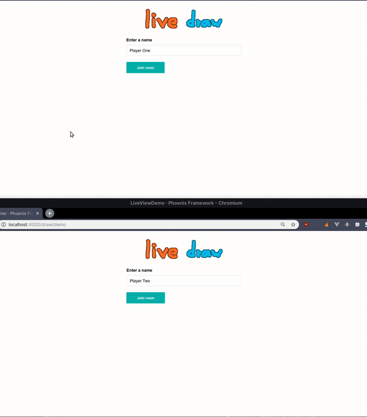

# LiveDraw

WIP. LiveDraw is a drawing game based on the skribbl.io idea, reimplemented with LiveView. The drawing mechanism uses SVG to make use of the DOM diffing capabilities and has been updated to use hooks for the drawing itself. It's been fun to see how far it could be pushed even before hooks were supported.

This is my entry in [Phoenix Phrenzy](https://phoenixphrenzy.com), showing off what [Phoenix](https://phoenixframework.org/) and [LiveView](https://github.com/phoenixframework/phoenix_live_view) can do.

## Preview

## Todo

  * clear canvas after turn
  * add random words and dictionary
  * end turn if everyone correcly guessed
  * only allow room owner to start game
  * room max players and error messages
  * account for port in invite link

## Startup

To start your Phoenix server:

  * Install dependencies with `mix deps.get`
  * Create and migrate your database with `mix ecto.setup`
  * Install Node.js dependencies with `cd assets && npm install`
  * Start Phoenix endpoint with `mix phx.server`

Now you can visit [`localhost:4000`](http://localhost:4000) from your browser.

Ready to run in production? Please [check our deployment guides](https://hexdocs.pm/phoenix/deployment.html).

## Learn more

  * Official website: http://www.phoenixframework.org/
  * Guides: https://hexdocs.pm/phoenix/overview.html
  * Docs: https://hexdocs.pm/phoenix
  * Mailing list: http://groups.google.com/group/phoenix-talk
  * Source: https://github.com/phoenixframework/phoenix
